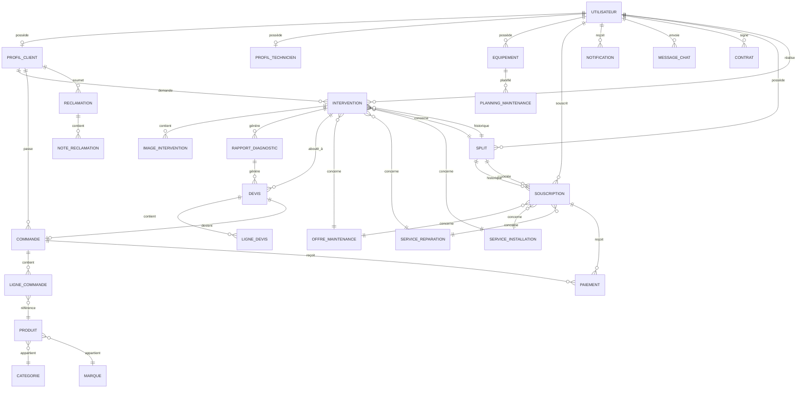

# Documentation Base de Données - MCT Maintenance

## 📊 Vue d'ensemble

La base de données MCT Maintenance est une base relationnelle SQLite utilisant Sequelize comme ORM. Elle gère un système complet de maintenance de climatiseurs incluant :
- Gestion des utilisateurs (clients, techniciens, admins)
- Interventions et diagnostics
- Souscriptions et contrats
- Commerce (produits, devis, commandes)
- Notifications et messagerie

---

## 🎯 MCD - Modèle Conceptuel de Données

Le MCD représente les entités métier et leurs associations conceptuelles, indépendamment de l'implémentation technique.

### Diagramme Entité-Relation



### Entités Principales

| Entité | Description | Cardinalité clé |
|--------|-------------|-----------------|
| **UTILISATEUR** | Personne utilisant le système | Centre du système |
| **PROFIL_CLIENT** | Informations spécifiques client | 0,1 par utilisateur |
| **PROFIL_TECHNICIEN** | Informations spécifiques technicien | 0,1 par utilisateur |
| **INTERVENTION** | Demande de service | 0,n par client |
| **SPLIT** | Équipement tracé par QR code | 0,n par client |
| **SOUSCRIPTION** | Abonnement maintenance | 0,n par client |
| **DEVIS** | Proposition commerciale | 0,n par intervention |
| **COMMANDE** | Achat validé | 0,1 par devis |

---

## 📐 MLD - Modèle Logique de Données

Le MLD traduit le MCD en tables relationnelles avec clés primaires et étrangères.

### Tables et Relations

#### 1. Module Utilisateurs

```
USERS (id, email, first_name, last_name, password_hash, phone, role, status, 
       last_login, email_verified, phone_verified, profile_image, fcm_token, createdAt, updatedAt)
    PK: id
    UNIQUE: email, phone

CUSTOMER_PROFILES (id, user_id, address, city, zip_code, latitude, longitude, 
                   company_name, notes, createdAt, updatedAt)
    PK: id
    FK: user_id → USERS(id)

TECHNICIAN_PROFILES (id, user_id, google_calendar_id, google_refresh_token, 
                     certification, experience_years, specialization, hourly_rate, 
                     available, working_hours, rating, total_reviews, createdAt, updatedAt)
    PK: id
    FK: user_id → USERS(id)
```

#### 2. Module Services

```
MAINTENANCE_OFFERS (id, title, description, equipment_type, image, price, 
                    duration_months, visits_per_year, services_included, 
                    is_active, createdAt, updatedAt)
    PK: id

INSTALLATION_SERVICES (id, title, description, model, image, price, 
                       installation_steps, warranty_period, is_active, createdAt, updatedAt)
    PK: id

REPAIR_SERVICES (id, title, description, model, image, base_price, 
                 estimated_duration, common_issues, is_active, createdAt, updatedAt)
    PK: id

SUBSCRIPTIONS (id, customer_id, maintenance_offer_id, installation_service_id, 
               repair_service_id, split_id, start_date, end_date, status, 
               equipment_count, equipment_used, total_amount, payment_status, 
               payment_reference, createdAt, updatedAt)
    PK: id
    FK: customer_id → USERS(id)
    FK: maintenance_offer_id → MAINTENANCE_OFFERS(id)
    FK: installation_service_id → INSTALLATION_SERVICES(id)
    FK: repair_service_id → REPAIR_SERVICES(id)
    FK: split_id → SPLITS(id)
```

#### 3. Module Interventions

```
INTERVENTIONS (id, customer_id, technician_id, maintenance_offer_id, 
               repair_service_id, installation_service_id, split_id,
               title, description, intervention_type, priority, status,
               scheduled_date, preferred_time_slot, address, latitude, longitude,
               diagnostic_fee, is_free_diagnosis, diagnostic_paid, diagnostic_paid_at,
               rating, review, rated_at, total_amount, payment_status,
               customer_confirmed, customer_confirmed_at, customer_rejection_reason,
               started_at, completed_at, createdAt, updatedAt)
    PK: id
    FK: customer_id → CUSTOMER_PROFILES(id)
    FK: technician_id → USERS(id)
    FK: maintenance_offer_id → MAINTENANCE_OFFERS(id)
    FK: repair_service_id → REPAIR_SERVICES(id)
    FK: installation_service_id → INSTALLATION_SERVICES(id)
    FK: split_id → SPLITS(id)

INTERVENTION_IMAGES (id, intervention_id, image_url, image_type, description, createdAt, updatedAt)
    PK: id
    FK: intervention_id → INTERVENTIONS(id)

DIAGNOSTIC_REPORTS (id, intervention_id, technician_id, reviewed_by, 
                    findings, recommendations, estimated_cost, parts_needed,
                    labor_hours, status, reviewed_at, customer_notified, createdAt, updatedAt)
    PK: id
    FK: intervention_id → INTERVENTIONS(id)
    FK: technician_id → USERS(id)
    FK: reviewed_by → USERS(id)
```

#### 4. Module Commerce

```
PRODUCTS (id, nom, description, prix, stock, image, categorie_id, marque_id, 
          is_active, createdAt, updatedAt)
    PK: id
    FK: categorie_id → CATEGORIES(id)
    FK: marque_id → BRANDS(id)

CATEGORIES (id, nom, description, image, is_active, createdAt, updatedAt)
    PK: id

BRANDS (id, nom, description, logo, is_active, createdAt, updatedAt)
    PK: id

QUOTES (id, intervention_id, diagnostic_report_id, customer_id, 
        quote_number, status, subtotal, tax_rate, tax_amount, total,
        valid_until, notes, accepted_at, rejected_at, createdAt, updatedAt)
    PK: id
    FK: intervention_id → INTERVENTIONS(id)
    FK: diagnostic_report_id → DIAGNOSTIC_REPORTS(id)

QUOTE_ITEMS (id, quoteId, description, unit_price, quantity, total, createdAt, updatedAt)
    PK: id
    FK: quoteId → QUOTES(id)

ORDERS (id, customerId, quoteId, order_number, status, subtotal, 
        tax_rate, tax_amount, total, shipping_address, notes, createdAt, updatedAt)
    PK: id
    FK: customerId → CUSTOMER_PROFILES(id)
    FK: quoteId → QUOTES(id)

ORDER_ITEMS (id, orderId, productId, quantity, unit_price, total, createdAt, updatedAt)
    PK: id
    FK: orderId → ORDERS(id)
    FK: productId → PRODUCTS(id)
```

#### 5. Module Paiements

```
PAYMENTS (id, orderId, subscriptionId, transaction_id, amount, currency, 
          payment_method, status, payment_date, metadata, createdAt, updatedAt)
    PK: id
    FK: orderId → ORDERS(id)
    FK: subscriptionId → SUBSCRIPTIONS(id)

PAYMENT_LOGS (id, transaction_id, event_type, payload, createdAt, updatedAt)
    PK: id
```

#### 6. Module Communication

```
NOTIFICATIONS (id, user_id, type, title, message, data, is_read, read_at, 
               priority, action_url, createdAt, updatedAt)
    PK: id
    FK: user_id → USERS(id)

CHAT_MESSAGES (id, sender_id, receiver_id, content, is_read, createdAt, updatedAt)
    PK: id
    FK: sender_id → USERS(id)
```

#### 7. Module Support

```
COMPLAINTS (id, customerId, interventionId, orderId, type, subject, 
            description, status, priority, resolved_at, createdAt, updatedAt)
    PK: id
    FK: customerId → CUSTOMER_PROFILES(id)

COMPLAINT_NOTES (id, complaintId, userId, content, is_internal, createdAt, updatedAt)
    PK: id
    FK: complaintId → COMPLAINTS(id)
    FK: userId → USERS(id)

CONTRACTS (id, customer_id, type, start_date, end_date, status, 
           terms, total_value, createdAt, updatedAt)
    PK: id
    FK: customer_id → USERS(id)
```

#### 8. Module Équipements

```
EQUIPMENTS (id, customer_id, name, type, brand, model, serial_number, 
            installation_date, warranty_expires, last_maintenance, 
            next_maintenance, notes, createdAt, updatedAt)
    PK: id
    FK: customer_id → USERS(id)

SPLITS (id, customer_id, qr_code, brand, model, serial_number, 
        installation_date, location, photos, capacity, power, 
        refrigerant_type, status, warranty_expires, notes, createdAt, updatedAt)
    PK: id
    FK: customer_id → USERS(id)
    UNIQUE: qr_code

MAINTENANCE_SCHEDULES (id, equipment_id, technician_id, scheduled_date, 
                       status, notes, createdAt, updatedAt)
    PK: id
    FK: equipment_id → EQUIPMENTS(id)
    FK: technician_id → USERS(id)
```

#### 9. Module Système

```
SYSTEM_CONFIGS (id, key, value, type, category, description, createdAt, updatedAt)
    PK: id
    UNIQUE: key

PROMOTIONS (id, code, title, description, discount_type, discount_value, 
            min_purchase, max_uses, current_uses, start_date, end_date, 
            is_active, createdAt, updatedAt)
    PK: id
    UNIQUE: code

EMAIL_VERIFICATION_CODES (id, user_id, code, expires_at, used, createdAt, updatedAt)
    PK: id
    FK: user_id → USERS(id)

PASSWORD_RESET_CODES (id, user_id, code, expires_at, used, createdAt, updatedAt)
    PK: id
    FK: user_id → USERS(id)
```

---

## 💾 MPD - Modèle Physique de Données

Le MPD décrit l'implémentation concrète en SQLite avec types de données, index et contraintes.

### Script de création des tables principales

```sql
-- ==========================================
-- MPD MCT MAINTENANCE - SQLite
-- ==========================================

-- Table USERS
CREATE TABLE users (
    id INTEGER PRIMARY KEY AUTOINCREMENT,
    email VARCHAR(255) UNIQUE,
    first_name VARCHAR(100),
    last_name VARCHAR(100),
    password_hash VARCHAR(255) NOT NULL,
    phone VARCHAR(20) UNIQUE,
    role VARCHAR(20) NOT NULL DEFAULT 'customer' 
        CHECK (role IN ('admin', 'customer', 'technician', 'depannage', 'manager')),
    status VARCHAR(20) NOT NULL DEFAULT 'pending' 
        CHECK (status IN ('active', 'inactive', 'pending')),
    last_login DATETIME,
    email_verified BOOLEAN DEFAULT 0,
    phone_verified BOOLEAN DEFAULT 0,
    profile_image VARCHAR(255),
    fcm_token VARCHAR(255),
    createdAt DATETIME DEFAULT CURRENT_TIMESTAMP,
    updatedAt DATETIME DEFAULT CURRENT_TIMESTAMP
);

CREATE INDEX idx_users_email ON users(email);
CREATE INDEX idx_users_phone ON users(phone);
CREATE INDEX idx_users_role ON users(role);
CREATE INDEX idx_users_status ON users(status);

-- Table CUSTOMER_PROFILES
CREATE TABLE customer_profiles (
    id INTEGER PRIMARY KEY AUTOINCREMENT,
    user_id INTEGER NOT NULL UNIQUE,
    first_name VARCHAR(100),
    last_name VARCHAR(100),
    phone VARCHAR(20),
    address TEXT,
    city VARCHAR(100),
    zip_code VARCHAR(20),
    latitude DECIMAL(10, 8),
    longitude DECIMAL(11, 8),
    company_name VARCHAR(255),
    notes TEXT,
    createdAt DATETIME DEFAULT CURRENT_TIMESTAMP,
    updatedAt DATETIME DEFAULT CURRENT_TIMESTAMP,
    FOREIGN KEY (user_id) REFERENCES users(id) ON DELETE CASCADE
);

CREATE INDEX idx_customer_profiles_user ON customer_profiles(user_id);

-- Table TECHNICIAN_PROFILES
CREATE TABLE technician_profiles (
    id INTEGER PRIMARY KEY AUTOINCREMENT,
    user_id INTEGER NOT NULL UNIQUE,
    google_calendar_id VARCHAR(255),
    google_refresh_token TEXT,
    certification VARCHAR(255),
    experience_years INTEGER DEFAULT 0,
    specialization VARCHAR(255),
    hourly_rate DECIMAL(10, 2),
    available BOOLEAN DEFAULT 1,
    working_hours JSON,
    rating DECIMAL(3, 2) DEFAULT 0,
    total_reviews INTEGER DEFAULT 0,
    createdAt DATETIME DEFAULT CURRENT_TIMESTAMP,
    updatedAt DATETIME DEFAULT CURRENT_TIMESTAMP,
    FOREIGN KEY (user_id) REFERENCES users(id) ON DELETE CASCADE
);

CREATE INDEX idx_technician_profiles_user ON technician_profiles(user_id);
CREATE INDEX idx_technician_profiles_available ON technician_profiles(available);

-- Table MAINTENANCE_OFFERS
CREATE TABLE maintenance_offers (
    id INTEGER PRIMARY KEY AUTOINCREMENT,
    title VARCHAR(255) NOT NULL,
    description TEXT,
    equipment_type VARCHAR(100),
    image VARCHAR(255),
    price DECIMAL(10, 2) NOT NULL,
    duration_months INTEGER DEFAULT 12,
    visits_per_year INTEGER DEFAULT 2,
    services_included JSON,
    is_active BOOLEAN DEFAULT 1,
    createdAt DATETIME DEFAULT CURRENT_TIMESTAMP,
    updatedAt DATETIME DEFAULT CURRENT_TIMESTAMP
);

CREATE INDEX idx_maintenance_offers_active ON maintenance_offers(is_active);

-- Table INSTALLATION_SERVICES
CREATE TABLE installation_services (
    id INTEGER PRIMARY KEY AUTOINCREMENT,
    title VARCHAR(255) NOT NULL,
    description TEXT,
    model VARCHAR(255),
    image VARCHAR(255),
    price DECIMAL(10, 2) NOT NULL,
    installation_steps JSON,
    warranty_period INTEGER,
    is_active BOOLEAN DEFAULT 1,
    createdAt DATETIME DEFAULT CURRENT_TIMESTAMP,
    updatedAt DATETIME DEFAULT CURRENT_TIMESTAMP
);

-- Table REPAIR_SERVICES
CREATE TABLE repair_services (
    id INTEGER PRIMARY KEY AUTOINCREMENT,
    title VARCHAR(255) NOT NULL,
    description TEXT,
    model VARCHAR(255),
    image VARCHAR(255),
    base_price DECIMAL(10, 2),
    estimated_duration VARCHAR(50),
    common_issues JSON,
    is_active BOOLEAN DEFAULT 1,
    createdAt DATETIME DEFAULT CURRENT_TIMESTAMP,
    updatedAt DATETIME DEFAULT CURRENT_TIMESTAMP
);

-- Table SPLITS (Traçabilité QR)
CREATE TABLE splits (
    id INTEGER PRIMARY KEY AUTOINCREMENT,
    customer_id INTEGER,
    qr_code VARCHAR(255) NOT NULL UNIQUE,
    brand VARCHAR(100),
    model VARCHAR(100),
    serial_number VARCHAR(100),
    installation_date DATE,
    location VARCHAR(255),
    photos JSON,
    capacity VARCHAR(50),
    power VARCHAR(50),
    refrigerant_type VARCHAR(50),
    status VARCHAR(50) DEFAULT 'active' 
        CHECK (status IN ('active', 'inactive', 'maintenance', 'repair')),
    warranty_expires DATE,
    notes TEXT,
    createdAt DATETIME DEFAULT CURRENT_TIMESTAMP,
    updatedAt DATETIME DEFAULT CURRENT_TIMESTAMP,
    FOREIGN KEY (customer_id) REFERENCES users(id) ON DELETE SET NULL
);

CREATE INDEX idx_splits_customer ON splits(customer_id);
CREATE INDEX idx_splits_qr_code ON splits(qr_code);
CREATE INDEX idx_splits_status ON splits(status);

-- Table SUBSCRIPTIONS
CREATE TABLE subscriptions (
    id INTEGER PRIMARY KEY AUTOINCREMENT,
    customer_id INTEGER NOT NULL,
    maintenance_offer_id INTEGER,
    installation_service_id INTEGER,
    repair_service_id INTEGER,
    split_id INTEGER,
    start_date DATE NOT NULL,
    end_date DATE NOT NULL,
    status VARCHAR(50) DEFAULT 'pending'
        CHECK (status IN ('pending', 'active', 'expired', 'cancelled')),
    equipment_count INTEGER DEFAULT 1,
    equipment_used INTEGER DEFAULT 0,
    total_amount DECIMAL(10, 2),
    payment_status VARCHAR(50) DEFAULT 'pending'
        CHECK (payment_status IN ('pending', 'paid', 'failed', 'refunded')),
    payment_reference VARCHAR(255),
    createdAt DATETIME DEFAULT CURRENT_TIMESTAMP,
    updatedAt DATETIME DEFAULT CURRENT_TIMESTAMP,
    FOREIGN KEY (customer_id) REFERENCES users(id) ON DELETE CASCADE,
    FOREIGN KEY (maintenance_offer_id) REFERENCES maintenance_offers(id),
    FOREIGN KEY (installation_service_id) REFERENCES installation_services(id),
    FOREIGN KEY (repair_service_id) REFERENCES repair_services(id),
    FOREIGN KEY (split_id) REFERENCES splits(id)
);

CREATE INDEX idx_subscriptions_customer ON subscriptions(customer_id);
CREATE INDEX idx_subscriptions_status ON subscriptions(status);
CREATE INDEX idx_subscriptions_dates ON subscriptions(start_date, end_date);

-- Table INTERVENTIONS
CREATE TABLE interventions (
    id INTEGER PRIMARY KEY AUTOINCREMENT,
    customer_id INTEGER NOT NULL,
    technician_id INTEGER,
    maintenance_offer_id INTEGER,
    repair_service_id INTEGER,
    installation_service_id INTEGER,
    split_id INTEGER,
    title VARCHAR(255) NOT NULL,
    description TEXT,
    intervention_type VARCHAR(50) DEFAULT 'maintenance'
        CHECK (intervention_type IN ('maintenance', 'repair', 'installation', 'diagnostic')),
    priority VARCHAR(20) DEFAULT 'normal'
        CHECK (priority IN ('low', 'normal', 'medium', 'high', 'urgent', 'critical')),
    status VARCHAR(50) DEFAULT 'pending'
        CHECK (status IN ('pending', 'assigned', 'accepted', 'on_the_way', 'arrived', 'in_progress', 'completed', 'cancelled')),
    scheduled_date DATE,
    preferred_time_slot VARCHAR(50),
    address TEXT,
    latitude DECIMAL(10, 8),
    longitude DECIMAL(11, 8),
    diagnostic_fee DECIMAL(10, 2) DEFAULT 0,
    is_free_diagnosis BOOLEAN DEFAULT 0,
    diagnostic_paid BOOLEAN DEFAULT 0,
    diagnostic_paid_at DATETIME,
    rating INTEGER CHECK (rating >= 1 AND rating <= 5),
    review TEXT,
    rated_at DATETIME,
    total_amount DECIMAL(10, 2),
    payment_status VARCHAR(50) DEFAULT 'pending',
    customer_confirmed BOOLEAN,
    customer_confirmed_at DATETIME,
    customer_rejection_reason TEXT,
    started_at DATETIME,
    completed_at DATETIME,
    createdAt DATETIME DEFAULT CURRENT_TIMESTAMP,
    updatedAt DATETIME DEFAULT CURRENT_TIMESTAMP,
    FOREIGN KEY (customer_id) REFERENCES customer_profiles(id) ON DELETE CASCADE,
    FOREIGN KEY (technician_id) REFERENCES users(id) ON DELETE SET NULL,
    FOREIGN KEY (maintenance_offer_id) REFERENCES maintenance_offers(id),
    FOREIGN KEY (repair_service_id) REFERENCES repair_services(id),
    FOREIGN KEY (installation_service_id) REFERENCES installation_services(id),
    FOREIGN KEY (split_id) REFERENCES splits(id)
);

CREATE INDEX idx_interventions_customer ON interventions(customer_id);
CREATE INDEX idx_interventions_technician ON interventions(technician_id);
CREATE INDEX idx_interventions_status ON interventions(status);
CREATE INDEX idx_interventions_type ON interventions(intervention_type);
CREATE INDEX idx_interventions_scheduled ON interventions(scheduled_date);

-- Table INTERVENTION_IMAGES
CREATE TABLE intervention_images (
    id INTEGER PRIMARY KEY AUTOINCREMENT,
    intervention_id INTEGER NOT NULL,
    image_url VARCHAR(255) NOT NULL,
    image_type VARCHAR(50) DEFAULT 'before'
        CHECK (image_type IN ('before', 'during', 'after', 'problem', 'solution', 'report')),
    description TEXT,
    createdAt DATETIME DEFAULT CURRENT_TIMESTAMP,
    updatedAt DATETIME DEFAULT CURRENT_TIMESTAMP,
    FOREIGN KEY (intervention_id) REFERENCES interventions(id) ON DELETE CASCADE
);

CREATE INDEX idx_intervention_images_intervention ON intervention_images(intervention_id);

-- Table DIAGNOSTIC_REPORTS
CREATE TABLE diagnostic_reports (
    id INTEGER PRIMARY KEY AUTOINCREMENT,
    intervention_id INTEGER NOT NULL,
    technician_id INTEGER NOT NULL,
    reviewed_by INTEGER,
    findings TEXT,
    recommendations TEXT,
    estimated_cost DECIMAL(10, 2),
    parts_needed JSON,
    labor_hours DECIMAL(5, 2),
    status VARCHAR(50) DEFAULT 'draft'
        CHECK (status IN ('draft', 'submitted', 'reviewed', 'approved', 'rejected')),
    reviewed_at DATETIME,
    customer_notified BOOLEAN DEFAULT 0,
    createdAt DATETIME DEFAULT CURRENT_TIMESTAMP,
    updatedAt DATETIME DEFAULT CURRENT_TIMESTAMP,
    FOREIGN KEY (intervention_id) REFERENCES interventions(id) ON DELETE CASCADE,
    FOREIGN KEY (technician_id) REFERENCES users(id),
    FOREIGN KEY (reviewed_by) REFERENCES users(id)
);

CREATE INDEX idx_diagnostic_reports_intervention ON diagnostic_reports(intervention_id);
CREATE INDEX idx_diagnostic_reports_status ON diagnostic_reports(status);

-- Table QUOTES
CREATE TABLE quotes (
    id INTEGER PRIMARY KEY AUTOINCREMENT,
    intervention_id INTEGER,
    diagnostic_report_id INTEGER,
    customer_id INTEGER,
    quote_number VARCHAR(50) UNIQUE,
    status VARCHAR(50) DEFAULT 'draft'
        CHECK (status IN ('draft', 'sent', 'accepted', 'rejected', 'expired')),
    subtotal DECIMAL(10, 2),
    tax_rate DECIMAL(5, 2) DEFAULT 18,
    tax_amount DECIMAL(10, 2),
    total DECIMAL(10, 2),
    valid_until DATE,
    notes TEXT,
    accepted_at DATETIME,
    rejected_at DATETIME,
    createdAt DATETIME DEFAULT CURRENT_TIMESTAMP,
    updatedAt DATETIME DEFAULT CURRENT_TIMESTAMP,
    FOREIGN KEY (intervention_id) REFERENCES interventions(id),
    FOREIGN KEY (diagnostic_report_id) REFERENCES diagnostic_reports(id)
);

CREATE INDEX idx_quotes_intervention ON quotes(intervention_id);
CREATE INDEX idx_quotes_status ON quotes(status);

-- Table QUOTE_ITEMS
CREATE TABLE quote_items (
    id INTEGER PRIMARY KEY AUTOINCREMENT,
    quoteId INTEGER NOT NULL,
    description VARCHAR(255) NOT NULL,
    unit_price DECIMAL(10, 2) NOT NULL,
    quantity INTEGER DEFAULT 1,
    total DECIMAL(10, 2),
    createdAt DATETIME DEFAULT CURRENT_TIMESTAMP,
    updatedAt DATETIME DEFAULT CURRENT_TIMESTAMP,
    FOREIGN KEY (quoteId) REFERENCES quotes(id) ON DELETE CASCADE
);

-- Table PRODUCTS
CREATE TABLE products (
    id INTEGER PRIMARY KEY AUTOINCREMENT,
    nom VARCHAR(255) NOT NULL,
    description TEXT,
    prix DECIMAL(10, 2) NOT NULL,
    stock INTEGER DEFAULT 0,
    image VARCHAR(255),
    categorie_id INTEGER,
    marque_id INTEGER,
    is_active BOOLEAN DEFAULT 1,
    createdAt DATETIME DEFAULT CURRENT_TIMESTAMP,
    updatedAt DATETIME DEFAULT CURRENT_TIMESTAMP,
    FOREIGN KEY (categorie_id) REFERENCES categories(id),
    FOREIGN KEY (marque_id) REFERENCES brands(id)
);

CREATE INDEX idx_products_categorie ON products(categorie_id);
CREATE INDEX idx_products_marque ON products(marque_id);

-- Table CATEGORIES
CREATE TABLE categories (
    id INTEGER PRIMARY KEY AUTOINCREMENT,
    nom VARCHAR(255) NOT NULL,
    description TEXT,
    image VARCHAR(255),
    is_active BOOLEAN DEFAULT 1,
    createdAt DATETIME DEFAULT CURRENT_TIMESTAMP,
    updatedAt DATETIME DEFAULT CURRENT_TIMESTAMP
);

-- Table BRANDS
CREATE TABLE brands (
    id INTEGER PRIMARY KEY AUTOINCREMENT,
    nom VARCHAR(255) NOT NULL,
    description TEXT,
    logo VARCHAR(255),
    is_active BOOLEAN DEFAULT 1,
    createdAt DATETIME DEFAULT CURRENT_TIMESTAMP,
    updatedAt DATETIME DEFAULT CURRENT_TIMESTAMP
);

-- Table ORDERS
CREATE TABLE orders (
    id INTEGER PRIMARY KEY AUTOINCREMENT,
    customerId INTEGER NOT NULL,
    quoteId INTEGER,
    order_number VARCHAR(50) UNIQUE,
    status VARCHAR(50) DEFAULT 'pending'
        CHECK (status IN ('pending', 'confirmed', 'processing', 'shipped', 'delivered', 'cancelled')),
    subtotal DECIMAL(10, 2),
    tax_rate DECIMAL(5, 2) DEFAULT 18,
    tax_amount DECIMAL(10, 2),
    total DECIMAL(10, 2),
    shipping_address TEXT,
    notes TEXT,
    createdAt DATETIME DEFAULT CURRENT_TIMESTAMP,
    updatedAt DATETIME DEFAULT CURRENT_TIMESTAMP,
    FOREIGN KEY (customerId) REFERENCES customer_profiles(id) ON DELETE CASCADE,
    FOREIGN KEY (quoteId) REFERENCES quotes(id)
);

CREATE INDEX idx_orders_customer ON orders(customerId);
CREATE INDEX idx_orders_status ON orders(status);

-- Table ORDER_ITEMS
CREATE TABLE order_items (
    id INTEGER PRIMARY KEY AUTOINCREMENT,
    orderId INTEGER NOT NULL,
    productId INTEGER,
    quantity INTEGER DEFAULT 1,
    unit_price DECIMAL(10, 2) NOT NULL,
    total DECIMAL(10, 2),
    createdAt DATETIME DEFAULT CURRENT_TIMESTAMP,
    updatedAt DATETIME DEFAULT CURRENT_TIMESTAMP,
    FOREIGN KEY (orderId) REFERENCES orders(id) ON DELETE CASCADE,
    FOREIGN KEY (productId) REFERENCES products(id)
);

-- Table PAYMENTS
CREATE TABLE payments (
    id INTEGER PRIMARY KEY AUTOINCREMENT,
    orderId INTEGER,
    subscriptionId INTEGER,
    transaction_id VARCHAR(255) UNIQUE,
    amount DECIMAL(10, 2) NOT NULL,
    currency VARCHAR(10) DEFAULT 'XOF',
    payment_method VARCHAR(50),
    status VARCHAR(50) DEFAULT 'pending'
        CHECK (status IN ('pending', 'completed', 'failed', 'refunded')),
    payment_date DATETIME,
    metadata JSON,
    createdAt DATETIME DEFAULT CURRENT_TIMESTAMP,
    updatedAt DATETIME DEFAULT CURRENT_TIMESTAMP,
    FOREIGN KEY (orderId) REFERENCES orders(id),
    FOREIGN KEY (subscriptionId) REFERENCES subscriptions(id)
);

CREATE INDEX idx_payments_order ON payments(orderId);
CREATE INDEX idx_payments_subscription ON payments(subscriptionId);
CREATE INDEX idx_payments_status ON payments(status);

-- Table NOTIFICATIONS
CREATE TABLE notifications (
    id INTEGER PRIMARY KEY AUTOINCREMENT,
    user_id INTEGER NOT NULL,
    type VARCHAR(100) NOT NULL,
    title VARCHAR(255) NOT NULL,
    message TEXT NOT NULL,
    data JSON,
    is_read BOOLEAN DEFAULT 0,
    read_at DATETIME,
    priority VARCHAR(20) DEFAULT 'normal',
    action_url VARCHAR(255),
    createdAt DATETIME DEFAULT CURRENT_TIMESTAMP,
    updatedAt DATETIME DEFAULT CURRENT_TIMESTAMP,
    FOREIGN KEY (user_id) REFERENCES users(id) ON DELETE CASCADE
);

CREATE INDEX idx_notifications_user ON notifications(user_id);
CREATE INDEX idx_notifications_read ON notifications(is_read);
CREATE INDEX idx_notifications_type ON notifications(type);

-- Table COMPLAINTS
CREATE TABLE complaints (
    id INTEGER PRIMARY KEY AUTOINCREMENT,
    customerId INTEGER NOT NULL,
    interventionId INTEGER,
    orderId INTEGER,
    type VARCHAR(50),
    subject VARCHAR(255) NOT NULL,
    description TEXT,
    status VARCHAR(50) DEFAULT 'open'
        CHECK (status IN ('open', 'in_progress', 'resolved', 'closed')),
    priority VARCHAR(20) DEFAULT 'normal',
    resolved_at DATETIME,
    createdAt DATETIME DEFAULT CURRENT_TIMESTAMP,
    updatedAt DATETIME DEFAULT CURRENT_TIMESTAMP,
    FOREIGN KEY (customerId) REFERENCES customer_profiles(id) ON DELETE CASCADE
);

CREATE INDEX idx_complaints_customer ON complaints(customerId);
CREATE INDEX idx_complaints_status ON complaints(status);

-- Table SYSTEM_CONFIGS
CREATE TABLE system_configs (
    id INTEGER PRIMARY KEY AUTOINCREMENT,
    key VARCHAR(255) NOT NULL UNIQUE,
    value TEXT,
    type VARCHAR(50) DEFAULT 'string',
    category VARCHAR(100),
    description TEXT,
    createdAt DATETIME DEFAULT CURRENT_TIMESTAMP,
    updatedAt DATETIME DEFAULT CURRENT_TIMESTAMP
);

CREATE INDEX idx_system_configs_key ON system_configs(key);
CREATE INDEX idx_system_configs_category ON system_configs(category);
```

---

## 📈 Statistiques

| Métrique | Valeur |
|----------|--------|
| Nombre de tables | 31 |
| Tables avec FK | 24 |
| Index créés | 35+ |
| Types de relations | 1:1, 1:N, N:1 |
| SGBD | SQLite |
| ORM | Sequelize |

---

## 🔄 Flux de données principaux

### 1. Création d'intervention
```
Client → Intervention → (Technicien assigné) → Diagnostic → Rapport → Devis → (Acceptation) → Commande → Paiement
```

### 2. Souscription maintenance
```
Client → Offre maintenance → Souscription → (Split QR associé) → Interventions périodiques
```

### 3. Traçabilité équipement
```
Split (QR) → Client → Souscriptions → Interventions (historique complet)
```

---

*Document généré le 1 mars 2026*
